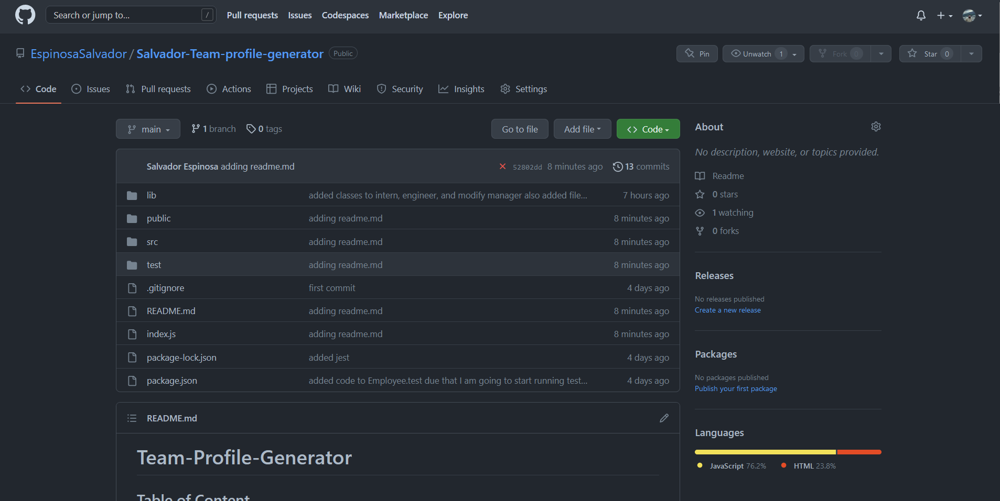
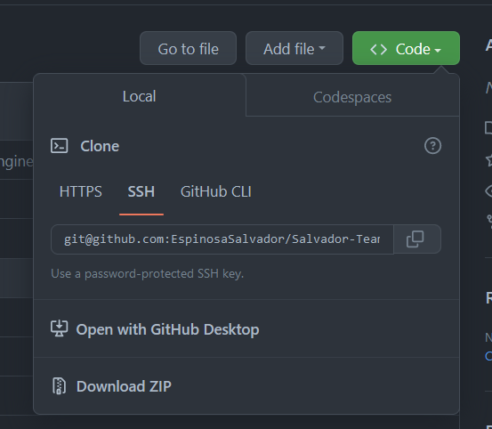
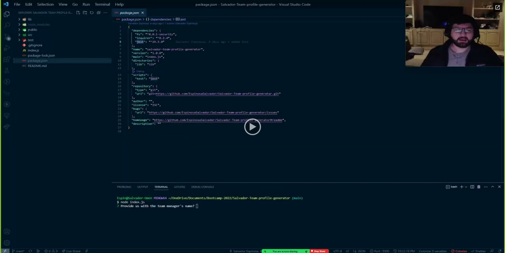
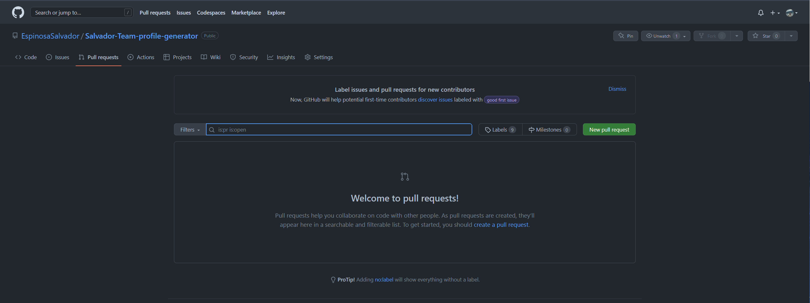
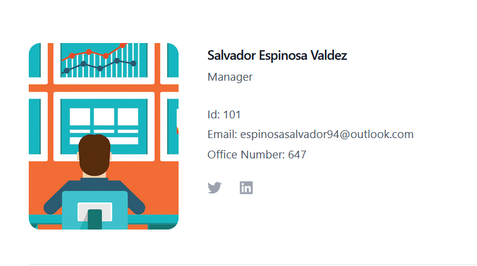
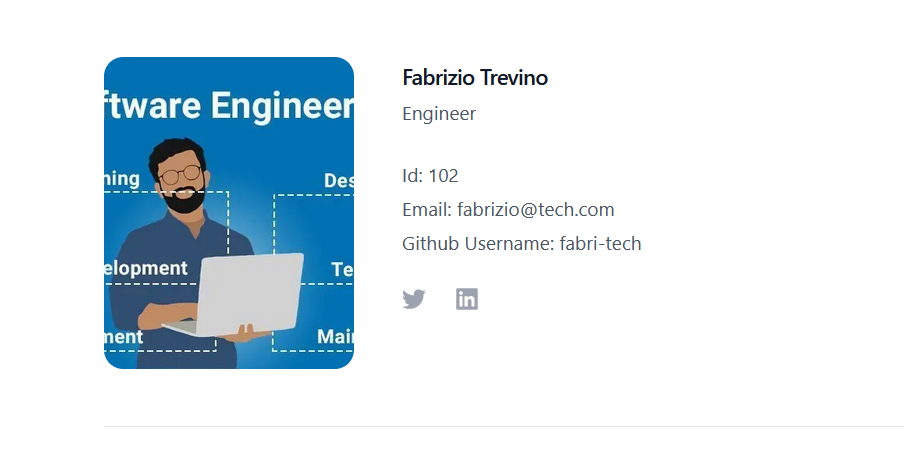
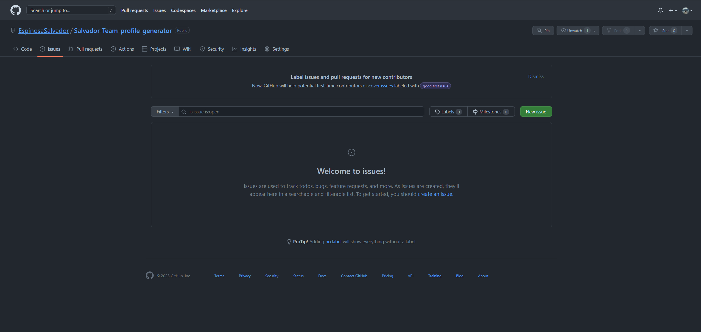

# Team-Profile-Generator

## Table of Content

* [Introduction](#introduction)
* [Features](#features)
* [Requirements](#requirements)
* [Installation](#installation)
* [Configuration](#configuration)
* [What you should be able to see](#what-you-should-be-able-to-see)
* [Troubleshooting](#troubleshooting)
* [Next Phase Development](#next-phase-development)
* [FAQ (Frecuently Asked Questions)](#faq-frecuentrly-asked-questions)
* [Team](#team)

## Introduction

Welcome to the team-profile-generator. This is a command line application that allows a user to create a webpage that displays the profile of team members. The user is able to enter team member's name, ID, email address, and additional information based on their role. The generated webpage displays all of the team member's profiles in a clean and organized manner.

## Features

* Creates profiles for each team member
* Generates a clean, organized HTML file that displays all of the team member's profiles
* Includes information based on role (Manager, Engineer, or Intern)

## Requirements

the requirements to run this webpage are really low due that we are only using *HTML*, *CSS* and *JS*.

* Vs code
* GitHub
* Internet
* Download JS to its latest release.
* Node.js
* inquirer
* fs

## Installation

To install this project please proceed to my [GitHub Repository](https://github.com/EspinosaSalvador/Salvador-Team-profile-generator)

you should be able to see this,



Click on code as shown in the image



Copy the SSH key or the HTTPS key and open.

* Terminal
* Git bash
* CMD

either one of this will work. please proceed to the terminal an put in your Terminal,

```
git clone git@github.com:EspinosaSalvador/Salvador-Team-profile-generator.git
```

and now you have a copy of the code.

here is a small video I recorded showing the webpage running and using it from my end.


[](https://drive.google.com/file/d/1dUe_RgVzD6j6ttdZ0Se2Fs5_mRyoInRt/preview)

## Configuration

If you want to do any configurations on this project please open a new branch you can do this by putting the following code in your terminal,

```
git checkout -b ＜new-branch＞
```

switch branches putting the following code on your terminal.

```
git checkout ＜branchname＞
```

If you want to show us your code and merge please open a pull request on 

[Github](https://github.com/EspinosaSalvador/Salvador-Team-profile-generator/pulls).



## What you should be able to see

These is what you should be able to see in the Webpage, after using the terminal for using the Manager, Engineer, Intern.


now I am going to show you each picture in order, as for this example we have, Manager, Engineer and Intern. the order depends on the that the user chooses to. 



Now Engineer.



and now the intern.


## Troubleshooting

The team-profile-generator is in version 1.0 ,please let me know if there are anybug in the webpage by issuing it in [Github](https://github.com/EspinosaSalvador/Salvador-Team-profile-generator/issues)



## Next Phase Development

This are will be updated depending on the feedback from the users.

## FAQ (Frecuentrly Asked Questions)

We will update this part when we have some frequently asked question.

## Team

* Salvador Espinosa Valdez
